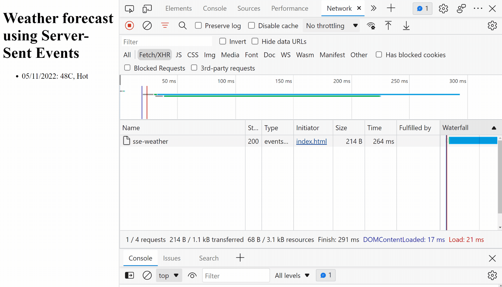

# Server-Sent Events in .NET 7 minimal web API

## Description

This repository contains a .NET 7 minimal web API example how to use Server-Sent Events (SSE) to stream data from a server to a client.

## Tech stack

The project uses the following components:

- [.NET 7](https://dotnet.microsoft.com/download/dotnet/7.0), version 7 of the .NET Framework.
- [Lib.AspNetCore.ServerSentEvents](https://github.com/tpeczek/Lib.AspNetCore.ServerSentEvents), a library that provides Server-Sent Events for ASP.NET Core.

## Building & running locally

The solution consists of two parts:

- The minimal web API, located in the `api` folder. This API will sent the events.
- An `index.html` file located in the root, that acts as the client. This client will receive the events.

### Prerequisites

- An IDE that supports C#/.NET to build and run the web API, I'm using [VS Code](https://code.visualstudio.com/) with the [C# extension](https://marketplace.visualstudio.com/items?itemName=ms-dotnettools.csharp).
- A way to locally host the `index.html` file. I'm using the [Live Server](https://marketplace.visualstudio.com/items?itemName=ritwickdey.LiveServer) extension for VS Code.

> If you use VSCode to open this repository, both the *C#* and *Live Server* extensions will be suggested to you to install.

### Running locally

1. Clone this repo and open the folder in VS Code.
2. Open the `index.html` file with the Live Server extension.
   - This will open a browser window with the `index.html` file at [http://127.0.0.1:5500/index.html](http://127.0.0.1:5500/index.html) that only shows the heading: '*Weather forecast using Server-Sent Events*'.
3. Run the web API by pressing `F5` in VS Code.
   - This will open an empty browser window at [http://localhost:5011/](http://localhost:5011/).
   - You'll see a message like '*This localhost page can’t be found*'. This is expected since the API doesn't have a default route or any UI.

The weather forecast page (at [http://127.0.0.1:5500/index.html](http://127.0.0.1:5500/index.html)) will now update every 2 seconds with new data.

## Contributing

Want to help contributing to this project? Have a look at our [contributing guide](CONTRIBUTING.md)!

## More info

If you have any questions or comments about this demo please join our [Discord](https://go.ably.com/discord) and have a chat!

- [Join our Discord server](https://go.ably.com/discord)
- [Follow us on Twitter](https://twitter.com/ablyrealtime)
- [Use our SDKs](https://github.com/ably/)
- [Visit our website](https://ably.com)

---

